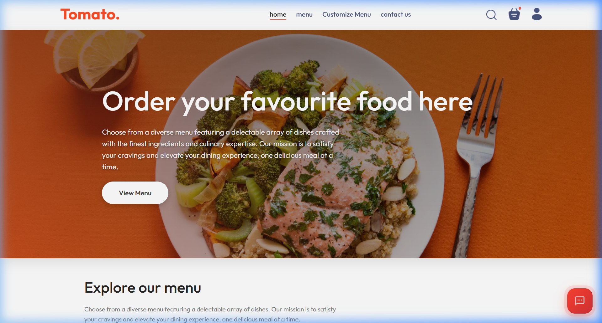
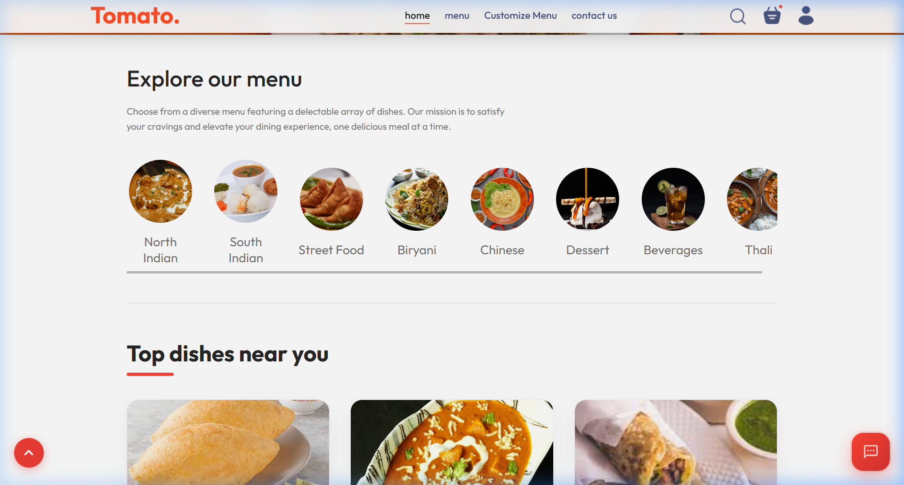
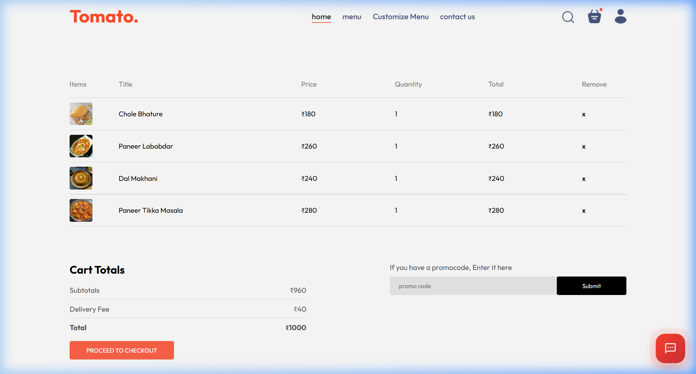
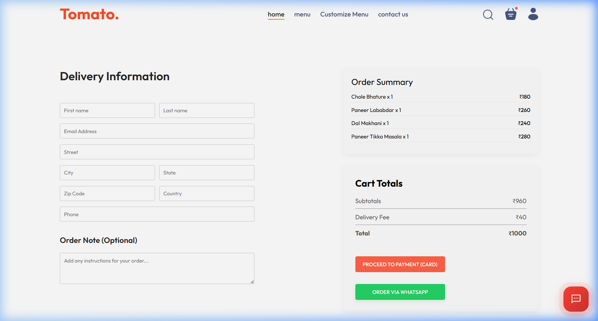
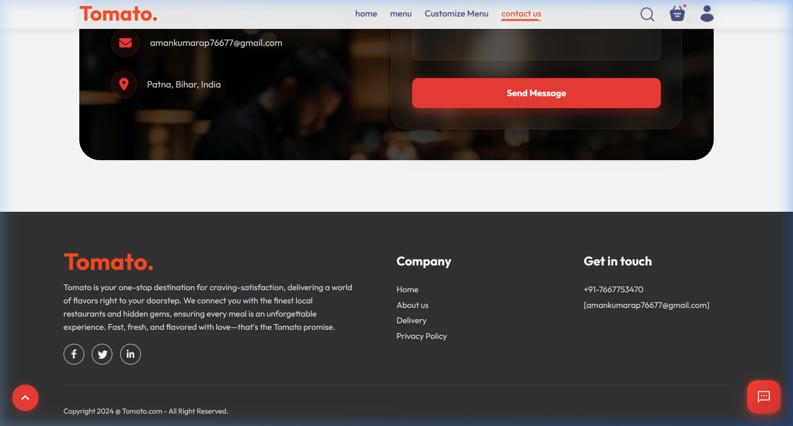
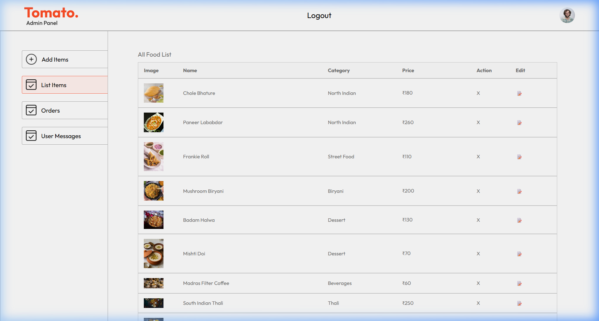
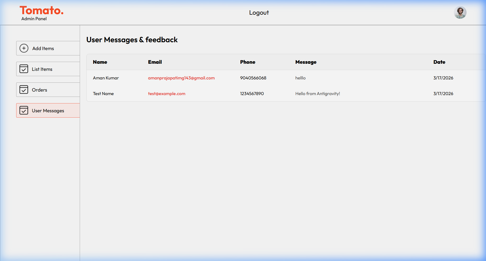

# 🍅 Tomato - Full Stack Indian Food Delivery Application

Tomato is a modern, high-performance, and feature-rich food ordering platform built using the **MERN Stack** (MongoDB, Express, React, Node.js). It offers a seamless experience for food lovers to explore a vast menu of authentic Indian dishes, customize their orders, and choose between traditional card payments or direct WhatsApp ordering.

---

## 🚀 Key Features

### 👤 User Panel
- **Authentic Indian Menu**: Over 200+ curated Indian dishes across categories like North Indian, Biryani, Street Food, and more.
- **AI-Powered Recommendations**: Personalized food suggestions based on popular choices and top ratings.
- **Smart Customization**: A dedicated "Customize Menu" feature allows users to build their perfect meal and share it via WhatsApp.
- **Full Checkout Flow**: Integrated shopping cart with real-time total calculation and delivery fee handling.
- **Dual Payment Options**:
  - **Online Payment**: Integrated with Stripe for secure credit/debit card transactions.
  - **WhatsApp Ordering**: A professional "Order via WhatsApp" API that formats order details (items, price, address) into a clear message.
- **Modern Contact Us**: A sleek, glassmorphism-designed contact section with automated WhatsApp and database integration.
- **Authentication**: Secure JWT-based login and signup with password hashing.
- **Mobile Responsive**: Fully optimized for Desktop, Tablet, and Mobile devices.

### 🛡️ Admin Dashboard
- **Product Management**: Add, update, or remove food items from the menu in real-time.
- **Order Tracking**: Manage customer orders and view delivery statuses.
- **User Feedback**: Centralized "User Messages" panel to read and respond to inquiries submitted via the Contact Us form.
- **Analytics & Lists**: Clear tabular views of all platform data for efficient management.

---

## 🛠 Tech Stack

- **Frontend**: React.js, Context API, CSS3 (Vanilla), React Router, Axios.
- **Backend**: Node.js, Express.js.
- **Database**: MongoDB with Mongoose ODM.
- **Authentication**: JSON Web Token (JWT) & Bcrypt.js.
- **Payments**: Stripe API.
- **Communications**: WhatsApp Business API Integration.
- **Media**: Multer for image uploads.

---

## 📸 Screenshots

### 🏠 Homepage

*Modern Hero section with a clean, responsive navigation bar.*

### 🍽️ Explore Menu

*Dynamic category filtering and rich food item cards.*

### 🛒 Shopping Cart

*Review selected items before proceeding to checkout.*

### 💳 Modern Checkout & WhatsApp API

*Choose between card payment or the itemized WhatsApp ordering system.*

### 📞 Contact Us (Glassmorphism UI)

*Interactive contact form with blur effects and smooth animations.*

### 📊 Admin Panel - Inventory Management

*Manage your restaurant's digital inventory with ease.*

### 📩 Admin Panel - User Messages

*Track and manage all customer feedback and inquiries.*

---

## ⚙️ Installation & Setup

### 1. Clone the Repository
```bash
git clone https://github.com/AmanKumar0104/FoodDelivery.git
cd Food-Delivery-main
```

### 2. Setup Backend (.env)
Create a `.env` file in the `backend` folder:
```env
MONGO_URL=your_mongodb_connection_string
JWT_SECRET=your_secret_key
STRIPE_SECRET_KEY=your_stripe_key
```

### 3. Install Dependencies & Start
**Backend:**
```bash
cd backend
npm install
npm run server
```

**Frontend:**
```bash
cd frontend
npm install
npm run dev
```

**Admin Panel:**
```bash
cd admin
npm install
npm run dev
```

---

## 🤝 Feedback
Reach out to me on [LinkedIn](https://www.linkedin.com/in/aman-kumar-full-stack-developer/) for any feedback or collaboration opportunities!
